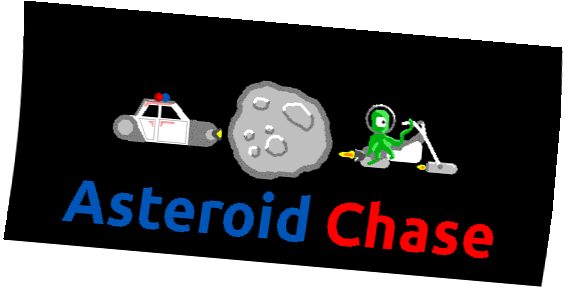

## PyWeek31 competition entry. 


### What dependencies your game requires to run
Game uses:
- arcade python library as a core.
- pygame to play sounds and music.
- pathlib to resolve paths for different OSs.
- pymunk as a physic engine.
- logging for logs.
- configparser to parse .ini files.

Checkout requirements.txt for details.

### How to build and run your game
Simply just fulfill requirements by
```
pip install -r requirements.txt
```
Then run the game
```
python run_game.py
```
To change screen resolution or sound settings, go to:
```
data/settings.ini
```


### The controls

SPACE - Laser \
SHIFT + SPACE - Super laser


### What there is to see in the game
You play as Jake. He is a police officer from the Outer Ring. 
He has just arrived in the capital to repair his rusty police ship. 
His plans change when he hears about a grand theft on the police radio. 
Help him catch the thieves of the imperial crown!


### Credits:
Game Design: VV0JCIECH, mit-mit \
Programming: VV0JCIECH, mit-mit \
Artwork: mit-mit, VV0JCIECH \
Music, voice and sfx: mit-mit (additional voice by "Em")

### Copyright attributions (eg. CC-BY external resources we have used)
```
"Police Siren" by MultiMax2121 (CC0)
https://freesound.org/people/MultiMax2121/sounds/156869/

"Car Crash" by Squareal (CC0)
https://freesound.org/people/squareal/sounds/237375/

"Explode001" by mitchelk (CC0)
https://freesound.org/people/mitchelk/sounds/136765/

"laser sounds" by chipfork71 (CC-BY-3.0)
https://freesound.org/people/chipfork71/sounds/72639/
```
